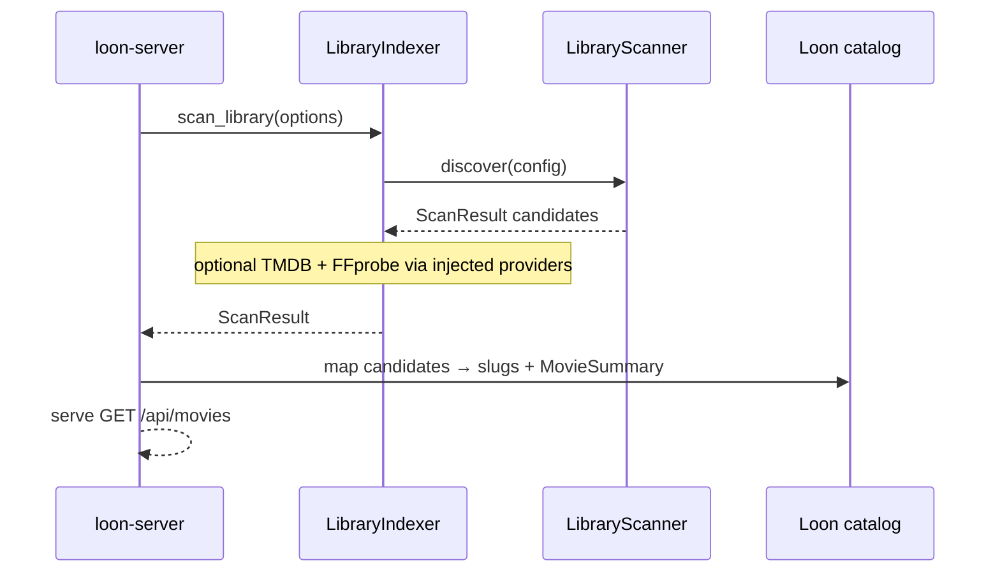
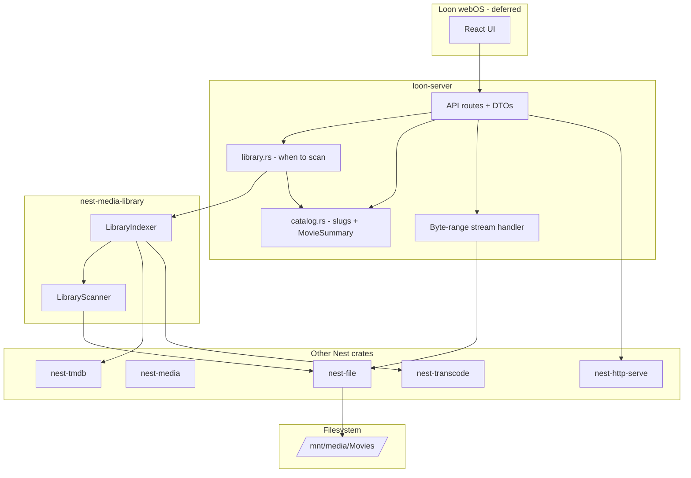

# Loon v1 Implementation Plan

## Status: Planned

First implementation plan for **Loon** — a self-hosted movie server and LG webOS client built on the Nest framework.

Product vision and principles live in [README](../README.md).

## Context

Loon is a **shipping product**, not a Nest framework crate. It lives in **[pacificnm/loon](https://github.com/pacificnm/loon)**, checked out at `nest/apps/loon/` beside the Nest monorepo via path-patched dependencies.

**Design principle:** Loon composes Nest building blocks into a movie server. Nest provides types, adapters, and HTTP hosting — not Loon's product workflow.

**Build in Loon first.** Do not block shipping on perfect Nest modules. Use existing Nest crates where they fit (especially [nest-media-library](../../../docs/plan/nest-media-library-v1.md) for discovery and indexing orchestration). When Loon-only logic proves reusable, extract it back into Nest (e.g. byte-range streaming → `nest-stream`).

**First milestone:** webOS (or curl) can call `GET /api/movies` and render a movie grid.

```text
LG webOS (later)
      │
HTTP JSON + byte-range stream
      │
Loon Server (loon-server)
      │
Nest building blocks (composed by Loon)
      │
Movie files on disk (/mnt/media/Movies/…)
```

## Ownership model

### Nest (reusable building blocks)

| Crate | Role |
|-------|------|
| `nest-media` | Media types and provider **contracts** (`Movie`, `MetadataProvider`, `MediaInspector`, …) |
| **`nest-media-library`** | **Generic** library discovery + indexing orchestration — see [nest-media-library v1](../../../docs/plan/nest-media-library-v1.md) |
| `nest-tmdb` | TMDB **metadata adapter** (`MetadataProvider`) |
| `nest-transcode` | FFprobe **media inspection** adapter (`MediaInspector`) |
| `nest-http-serve` | HTTP **host** (routing, JSON, CORS, tracing) |
| `nest-file` | Scoped filesystem I/O (`FileService`) |
| `nest-config` | TOML config loading |

[nest-media-library](../../../docs/plan/nest-media-library-v1.md) answers *how do we discover and index files into a library?* It does **not** know about Loon slugs, API DTOs, or HTTP routes.

### Loon (product composition)

| Area | Owner |
|------|-------|
| **Product library workflow** | **loon-server** — when to scan, map `ScanResult` → catalog, serve API |
| Loon movie rules (v0.1+) | **loon-server** — filter/map candidates (e.g. require title+year, slug assignment) |
| Routes + API DTOs | **loon-server** |
| Slugs | **loon-server** |
| Stream handler (byte-range) | **loon-server** for now → extract to `nest-stream` when stable |
| webOS app | **loon/webos** |

```text
nest-media           = media types / contracts
nest-media-library   = filesystem scan + indexing orchestration (generic)
nest-tmdb            = metadata provider
nest-transcode       = media inspection (FFprobe)
nest-http-serve      = HTTP host

loon-server          = composes those pieces into a movie server
```

### Where `nest-media-library` fits

Per [nest-media-library v1](../../../docs/plan/nest-media-library-v1.md):

| Layer | Responsibility |
|-------|----------------|
| `LibraryScanner` | **Discovery-only** — walk roots via `FileService`, filter video extensions, filename title/year heuristics → `ScanResult` |
| `LibraryIndexer` | **Optional orchestrator** — discover + optional FFprobe inspect + optional TMDB metadata + optional persist via injected traits |
| Loon | Calls scanner/indexer at startup (or via `POST /api/library/scan` in v0.2); maps `MovieScanCandidate` → slugs + `MovieSummary`; never reimplements directory walks |



**Key decision:** Loon v0.1 can start with `LibraryScanner::discover` (scan-only, no TMDB). Wire `LibraryIndexer` with `TmdbModule` + `TranscodeModule` when enrichment is ready. Loon-specific “what counts as a movie in the catalog” lives in `services/catalog.rs` (filter/map on top of generic candidates), not in `nest-media-library`.

## Repository layout

Loon is **not** a member of the nest workspace. Repository: **[github.com/pacificnm/loon](https://github.com/pacificnm/loon)** — local path `nest/apps/loon/`.

```text
loon/                              # separate git repo
├── README.md                      # product overview
├── docs/
│   └── v1.md                      # this plan
├── Cargo.toml                     # workspace root
├── .cargo/config.toml             # path-patch nest crates for local dev
├── server/                        # loon-server binary crate
│   ├── Cargo.toml
│   └── src/
│       ├── main.rs
│       ├── config.rs
│       ├── api/                   # route handlers
│       │   ├── mod.rs
│       │   ├── health.rs
│       │   └── movies.rs
│       ├── models/                # API DTOs (not nest-media types)
│       │   └── movie.rs
│       ├── services/              # Loon product workflow
│       │   ├── library.rs         # startup scan; calls LibraryScanner / LibraryIndexer
│       │   ├── enrichment.rs      # TMDB artwork paths + catalog merge
│       │   ├── catalog.rs         # ScanResult → slugs + MovieSummary
│       │   └── streaming.rs       # byte-range handler
│       ├── db/                    # Phase 3 — SQLite schema + repository
│       │   ├── mod.rs
│       │   ├── schema.sql
│       │   └── repository.rs
│       └── state.rs               # shared AppState
├── config.example.toml
└── webos/                         # deferred — see docs/webos-v1.md
    └── ...
```

Local development beside nest:

```text
nest/
├── core/crates/
├── modules/crates/
└── apps/
    └── loon/                      # git clone — ignored by nest
        ├── docs/
        ├── server/
        └── webos/
```

When developing locally, see the Nest [apps README](../../README.md).

### Path-patching Nest (local dev)

`.cargo/config.toml` in the Loon repo:

```toml
[patch."https://github.com/pacificnm/nest"]
nest-http-serve = { path = "../../core/crates/nest-http-serve" }
nest-media = { path = "../../core/crates/nest-media" }
nest-media-library = { path = "../../modules/crates/nest-media-library" }
nest-file = { path = "../../core/crates/nest-file" }
nest-tmdb = { path = "../../modules/crates/nest-tmdb" }
nest-transcode = { path = "../../modules/crates/nest-transcode" }
```

When checked out under `apps/loon/`, paths are relative to the nest monorepo root.

## Architecture



### Hard boundaries

**Loon (app) owns:**

- **Product library workflow** — startup scan timing, `ScanResult` → slug catalog → API DTOs
- **Loon movie rules** — filter/map `MovieScanCandidate` (e.g. skip unparseable titles; slug from title+year)
- HTTP route definitions and URL shapes (`POST /api/library/scan` in v0.2)
- API response DTOs (`MovieSummary`, health payload)
- Byte-range stream handler (for now)
- webOS client and playback UX
- Wiring Nest modules in startup

**Nest owns (via [nest-media-library](../../../docs/plan/nest-media-library-v1.md)):**

- Filesystem discovery (`LibraryScanner`), video extension filter, filename heuristics
- Scan models (`ScanResult`, `MovieScanCandidate`, …)
- Indexing orchestration (`LibraryIndexer`) calling injected `MetadataProvider` / `MediaInspector` / `MediaLibraryRepository`

**Nest owns (other crates):**

- Media domain types and provider trait contracts (`nest-media`)
- TMDB adapter (`nest-tmdb`), FFprobe adapter (`nest-transcode`)
- HTTP host (`nest-http-serve`), scoped file I/O (`nest-file`)

**Loon must not:**

- Redefine core media or scan types (use `nest-media`, `nest-media-library`)
- Reimplement directory walks, filename parsing, or TMDB/FFprobe adapters
- Put HTTP routes or Loon DTOs in Nest crates

**Extract back to Nest when obvious:**

- Stable byte-range logic → `nest-stream`
- Loon-only scan filters that generalize → contribute to `nest-media-library` heuristics
- SQLite repository patterns → Loon schema + `nest-data-sqlite` wiring

## Data model & persistence

This section defines **what Loon stores**, **how scan + TMDB data flows into storage**, and **where images, genres, favorites, and browse categories live**. Nest defines domain types; Loon owns the catalog schema and SQLite file.

### Storage by phase

| Phase | Storage | What persists |
|-------|---------|---------------|
| **0–1** | Hard-coded / sample `Vec<MovieSummary>` | Nothing |
| **2 (v0.1)** | In-memory `LoonCatalog` after each startup scan | Nothing across restarts |
| **3 (v0.2+)** | SQLite at `{data_dir}/loon.db` via `nest-data-sqlite` | Movies, file links, artwork refs, genres, favorites, watch progress |

```text
LibraryIndexer.scan_library()
        │
        ▼
   ScanResult { candidates: Vec<MovieScanCandidate> }
        │
        ├─ file: ScannedFile          ← filesystem (nest-media-library)
        ├─ guessed_title / year       ← filename heuristics
        ├─ inspection                ← FFprobe (nest-transcode)
        └─ metadata: MovieMetadata   ← TMDB (nest-tmdb)
        │
        ▼
   Loon catalog builder (services/catalog.rs)
        │
        ├─ assign slug
        ├─ merge artwork URLs (TmdbImageService)
        ├─ merge FFprobe tracks into Movie
        └─ build LoonMovieRecord
        │
        ▼
   v0.1: in-memory HashMap<slug, LoonMovieRecord>
   v0.2: LoonLibraryRepository → SQLite
```

### Layer responsibilities

| Layer | Types | Persisted? |
|-------|-------|------------|
| `nest-media-library` | `ScanResult`, `MovieScanCandidate`, `ScannedFile` | Transient scan output only |
| `nest-tmdb` | TMDB DTOs (internal) → `MovieMetadata` | Mapped fields land in Loon DB |
| `nest-media` | `Movie`, `MovieMetadata`, `Artwork`, `MediaTracks` | `Movie` is the canonical metadata blob; Loon adds file/slug columns |
| **Loon** | `LoonMovieRecord`, `MovieSummary`, slug, favorites, browse rows | **Yes** — Loon SQLite schema |

**Gap today:** `MediaLibraryRepository` in nest-media only exposes `save_movie` / `get_movie` / `list_movies` and the stock `LibraryIndexer` persist path does **not** save file paths, slugs, or artwork. Loon implements **`LoonLibraryRepository`** with a richer schema and uses the indexer for scan + metadata fetch; Loon's catalog builder handles the rest until persist is wired in Phase 3.

### In-memory catalog (Phase 2 / v0.1)

```rust
/// One playable movie in Loon's catalog — not a nest-media type.
pub struct LoonMovieRecord {
    pub slug: String,
    pub media_id: MediaId,
    pub file: ScannedFile,
    pub title: String,
    pub year: Option<u16>,
    pub runtime_seconds: Option<u32>,
    pub summary: Option<String>,
    pub genres: Vec<String>,
    pub poster_url: Option<String>,
    pub backdrop_url: Option<String>,
    pub external_ids: ExternalIds,
    pub tracks: MediaTracks,
    pub cast: Vec<PersonCredit>,
    pub crew: Vec<PersonCredit>,
    pub is_favorite: bool,
    pub watch_progress_seconds: Option<u32>,
}

pub struct LoonCatalog {
    by_slug: HashMap<String, LoonMovieRecord>,
    by_media_id: HashMap<MediaId, String>,
}
```

Built from `MovieScanCandidate`:

1. **Title / year** — prefer `metadata.title` / `metadata.year`; fall back to `guessed_*`
2. **Slug** — Loon rule on title + year (`alien-1979`)
3. **Genres** — `metadata.genres` (from TMDB)
4. **Poster / backdrop** — see [Images](#images) below
5. **Tracks** — merge `metadata.tracks` with `inspection.tracks` (FFprobe wins for local file)
6. **media_id** — stable id for persistence: `file:{relative_path}` (matches indexer convention)

### TMDB → nest-media mapping

Review against [nest-tmdb mapper](../../../modules/crates/nest-tmdb/src/mapper.rs). Apps never store raw TMDB DTOs.

| TMDB source | nest-media field | Stored in Loon |
|-------------|------------------|----------------|
| `id` | `MovieMetadata.external_id` (`tmdb:{id}`), `ExternalIds.tmdb_id` | `movies.tmdb_id` |
| `imdb_id` (external_ids) | `ExternalIds.imdb_id` | `movies.imdb_id` |
| `title` | `title` | `movies.title` |
| `original_title` | `original_title` | `movies.original_title` |
| `release_date` | `year` | `movies.year` |
| `runtime` (minutes) | `runtime_seconds` | `movies.runtime_seconds` |
| `overview` | `summary` | `movies.summary` |
| `genres[].name` | `genres: Vec<String>` | `movie_genres` + denormalized on read |
| cast | `cast: Vec<PersonCredit>` | JSON column or `movie_credits` (v0.2) |
| crew | `crew: Vec<PersonCredit>` | JSON column or `movie_credits` (v0.2) |
| `poster_path` | **not** on `MovieMetadata` | `movie_artwork.tmdb_path` (poster) |
| `backdrop_path` | **not** on `MovieMetadata` | `movie_artwork.tmdb_path` (backdrop) |

**Indexer behavior:** `LibraryIndexer` searches TMDB by guessed title/year, then calls `get_movie`. Loon must capture `poster_path` / `backdrop_path` at fetch time (via `TmdbMovieMapper::artwork_paths` or `TmdbImageService`) because they are dropped when only `MovieMetadata` is kept on the candidate.

### Images

**v0.1 — remote URLs only (no local image cache):**

- Store TMDB **path tokens** in SQLite (`/abc123.jpg`), not binary blobs
- Build client-facing URLs at API time with `TmdbImageService`:
  - Poster grid: `ImageSize::W500`
  - Hero/backdrop: `ImageSize::W1280`
- `MovieSummary.poster_url` / `backdrop_url` are full HTTPS URLs in API responses

```rust
let (poster_path, backdrop_path) = artwork_paths(&tmdb_movie_dto);
let poster_url = poster_path.map(|p| images.poster_url(&p, ImageSize::W500));
let backdrop_url = backdrop_path.map(|p| images.backdrop_url(&p, ImageSize::W1280));
```

**v0.2+ — optional local cache** via [nest-cache-file](../../../docs/plan/nest-cache-v1.md) (planned):

| Approach | When |
|----------|------|
| Remote URL only | v0.1 ship target — simplest, TMDB CDN handles delivery |
| `{data_dir}/cache/images/{tmdb_id}/poster.jpg` | v0.2 if webOS needs offline posters or TMDB rate limits bite |
| Serve cached images via `GET /api/artwork/:slug/:kind` | Loon proxy route; webOS never talks to TMDB directly |

Nest [`Artwork`](../../../core/crates/nest-media/src/artwork.rs) models this as `ArtworkSource::RemoteUrl` (v0.1) or `LocalPath` (cached v0.2).

### Genres

- **Source of truth:** TMDB genre names on `MovieMetadata.genres` (e.g. `"Horror"`, `"Science Fiction"`)
- **Storage:** junction table `movie_genres(movie_id, genre)` for browse-by-genre queries
- **API:** include `genres: Vec<String>` on movie detail; optional `GET /api/genres` listing distinct genres (v0.2)
- **Browse rows:** genre rows are **Loon categories**, not TMDB entities — e.g. row slug `genre-horror` queries `movie_genres WHERE genre = 'Horror'`

No separate TMDB genre id table in v0.1; add `tmdb_genre_id` later if we need stable ids across language changes.

### Favorites

Loon-owned user preference (single household, no auth in v0.2):

```sql
CREATE TABLE favorites (
    movie_id   TEXT NOT NULL REFERENCES movies(id) ON DELETE CASCADE,
    added_at   INTEGER NOT NULL,
    PRIMARY KEY (movie_id)
);
```

- Toggle via `PUT /api/movies/:slug/favorite` (v0.2)
- Browse row `favorites` = `SELECT … FROM movies JOIN favorites … ORDER BY added_at DESC`
- In-memory v0.1: `LoonMovieRecord.is_favorite` (lost on restart until SQLite)

### Categories / browse rows

Netflix-style rows are **Loon presentation**, not nest-media types:

| Row slug | `row_type` | Query |
|----------|------------|-------|
| `recently-added` | `recently_added` | movies ordered by `scanned_at` desc |
| `favorites` | `favorites` | join `favorites` |
| `continue-watching` | `continue_watching` | join `watch_progress` where incomplete |
| `genre-{name}` | `genre` | join `movie_genres` |
| `all-movies` | `static` | full library |

```sql
CREATE TABLE browse_rows (
    id          TEXT PRIMARY KEY,
    slug        TEXT NOT NULL UNIQUE,
    title       TEXT NOT NULL,
    row_type    TEXT NOT NULL,
    sort_order  INTEGER NOT NULL
);
```

v0.1 API exposes flat `GET /api/movies` only. v0.2 adds `GET /api/browse` returning rows + movie summaries.

### SQLite schema (Phase 3 / v0.2)

Loon schema lives in **`loon-server`** (`server/src/db/schema.sql`, `server/src/db/repository.rs`), implemented with `nest-data-sqlite`. It extends beyond `MediaLibraryRepository`:

```sql
-- Playback link: file on disk ↔ Nest media id
CREATE TABLE library_files (
    id              TEXT PRIMARY KEY,
    media_id        TEXT NOT NULL REFERENCES movies(id) ON DELETE CASCADE,
    library_id      TEXT NOT NULL,
    relative_path   TEXT NOT NULL UNIQUE,
    size_bytes      INTEGER NOT NULL,
    modified_secs   INTEGER,
    scanned_at      INTEGER NOT NULL
);

-- Canonical movie metadata (Nest MediaId as PK)
CREATE TABLE movies (
    id                  TEXT PRIMARY KEY,
    slug                TEXT NOT NULL UNIQUE,
    title               TEXT NOT NULL,
    original_title      TEXT,
    year                INTEGER,
    runtime_seconds     INTEGER,
    summary             TEXT,
    rating              TEXT,
    tmdb_id             TEXT,
    imdb_id             TEXT,
    cast_json           TEXT,          -- PersonCredit[] as JSON for v0.2
    crew_json           TEXT,
    tracks_json         TEXT,          -- MediaTracks as JSON
    created_at          INTEGER NOT NULL,
    updated_at          INTEGER NOT NULL
);

CREATE TABLE movie_artwork (
    movie_id    TEXT NOT NULL REFERENCES movies(id) ON DELETE CASCADE,
    kind        TEXT NOT NULL,         -- poster | backdrop
    tmdb_path   TEXT,                  -- /path.jpg — rebuild URL with TmdbImageService
    local_path  TEXT,                  -- optional cache file
    PRIMARY KEY (movie_id, kind)
);

CREATE TABLE movie_genres (
    movie_id    TEXT NOT NULL REFERENCES movies(id) ON DELETE CASCADE,
    genre       TEXT NOT NULL,
    PRIMARY KEY (movie_id, genre)
);

CREATE TABLE favorites (
    movie_id    TEXT NOT NULL REFERENCES movies(id) ON DELETE CASCADE,
    added_at    INTEGER NOT NULL,
    PRIMARY KEY (movie_id)
);

CREATE TABLE watch_progress (
    movie_id            TEXT PRIMARY KEY REFERENCES movies(id) ON DELETE CASCADE,
    position_seconds    INTEGER NOT NULL,
    duration_seconds    INTEGER,
    updated_at          INTEGER NOT NULL
);

CREATE INDEX idx_movies_slug ON movies(slug);
CREATE INDEX idx_movies_year ON movies(year);
CREATE INDEX idx_movie_genres_genre ON movie_genres(genre);
CREATE INDEX idx_library_files_path ON library_files(relative_path);
```

**Scan + persist flow (v0.2):**

```rust
let result = indexer
    .scan_library(&config, LibraryScanOptions {
        inspect_files: true,
        fetch_metadata: true,
        persist: false,  // Loon persist is richer than MediaLibraryRepository v0.1
    })
    .await?;

for candidate in result.candidates {
    let record = catalog.build_record(&candidate, &image_service).await?;
    repository.upsert_movie(&record)?;  // writes movies + library_files + artwork + genres
}
```

Optionally implement `MediaLibraryRepository` as a thin adapter over `movies` for Nest compatibility, but **Loon code should call `LoonLibraryRepository`**.

### Config

```toml
[loon]
bind = "0.0.0.0:3000"
data_dir = "/var/lib/loon"    # SQLite + optional image cache (v0.2)

[media-library]
id = "main"
roots = ["Movies"]
```

## API (v0.1)

| Method | Path | Purpose |
|--------|------|---------|
| `GET` | `/api/health` | Liveness + service identity |
| `GET` | `/api/movies` | List movies for grid/browse |
| `GET` | `/api/movies/:slug` | Single movie detail |
| `GET` | `/stream/:slug` | Byte-range video stream for playback |

All JSON routes return `application/json`. Stream route returns `video/*` with `Accept-Ranges: bytes`.

### API DTOs (Loon-owned)

These are **presentation types** for the webOS client — not `nest_media::Movie`.

```rust
#[derive(Debug, Clone, Serialize)]
pub struct MovieSummary {
    pub slug: String,
    pub title: String,
    pub year: u16,
    pub runtime_minutes: u16,
    pub poster_url: Option<String>,
    pub backdrop_url: Option<String>,
    pub summary: String,
}
```

Map from `MovieScanCandidate` / `nest_media::MovieMetadata` + Loon slug rules in `server/src/services/catalog.rs`.

### Slug convention

v0.1: lowercase `{title}-{year}` with non-alphanumeric collapsed to `-`:

- `Alien` (1979) → `alien-1979`
- `Blade Runner` (1982) → `blade-runner-1982`

Store slug in Loon's catalog (memory v0.1, SQLite v0.2). Do not expose raw filesystem paths in API responses.

### Health response

```json
{
  "status": "ok",
  "service": "loon-server"
}
```

## Implementation phases

### Phase 0 — Bootstrap spike (optional, 1 day)

Validate the API contract with **standalone Axum** (no Nest yet). Matches the spike in product notes:

- `cargo new server` → `loon-server`
- Hard-coded `sample_movies()` for Alien + Blade Runner
- Routes: `/api/health`, `/api/movies`, `/api/movies/:slug`
- CORS + trace layers
- Bind `0.0.0.0:3000`

**Exit criteria:**

```bash
curl http://SERVER:3000/api/health
curl http://SERVER:3000/api/movies
curl http://SERVER:3000/api/movies/alien-1979
```

**Note:** Skip `/stream/:slug` in Phase 0 or add a minimal whole-file response; byte-range comes in Phase 2.

### Phase 1 — Nest HTTP host (M0 ship target)

Replace raw Axum bootstrap with **nest-http-serve** for routing, JSON, CORS, tracing, and graceful shutdown.

```rust
use nest_http_serve::{HttpServer, RouteGroup, Json, RequestContext, HttpResult};

HttpServer::builder()
    .name("loon-server")
    .bind("0.0.0.0:3000")
    .routes(api_routes())
    .run()
    .await?;
```

Still use **in-memory sample movies** or a simple JSON file catalog — no scan yet.

**Nest deps (Phase 1):**

- `nest-http-serve`
- `nest-error`
- `nest-logging` (optional file + console init)

### Phase 2 — Real library + stream (M1)

Wire [nest-media-library](../../../docs/plan/nest-media-library-v1.md) for discovery and optional enrichment. Loon adds product workflow on top in `services/library.rs` + `services/catalog.rs`.

| Nest crate | Role in Loon Phase 2 |
|------------|----------------------|
| `nest-config` | `[loon]`, `[media-library]`, `[tmdb]`, `[transcode]` sections |
| `nest-file` | Scoped access to `/mnt/media/` (library roots relative to scope) |
| **`nest-media-library`** | `LibraryScanner` (v0.1 scan-only) → `LibraryIndexer` (inspect + TMDB when wired) |
| `nest-media` | Domain types used by scan results and providers |
| `nest-tmdb` | Injected into `MediaLibraryModule` for metadata |
| `nest-transcode` | Injected into `MediaLibraryModule` for FFprobe |
| `nest-http-client` | TMDB transport (via `TmdbModule`) |
| `nest-task-runtime` | Optional background scan via `LibraryScanTask` |

**Library roots (example):**

```text
/mnt/media/Movies/
├── Alien (1979)/Alien (1979).mp4
└── Blade Runner (1982)/Blade Runner (1982).mp4
```

**Loon usage** (from [nest-media-library v1](../../../docs/plan/nest-media-library-v1.md)):

```rust
// Phase 2a: scan-only on startup (no TMDB key required)
let scanner = ctx.service::<LibraryScanner>()?;
let config = MediaLibraryConfig::new("main", ["Movies"]);
let result = scanner.discover(&config)?;

// Phase 2b: full enrichment when providers wired
let indexer = ctx.service::<LibraryIndexer>()?;
let result = indexer
    .scan_library(
        &config,
        LibraryScanOptions {
            inspect_files: true,
            fetch_metadata: true,
            persist: false, // in-memory catalog v0.1; SQLite in Phase 3
        },
    )
    .await?;
```

Then in `services/catalog.rs`: map `result.candidates` → `LoonMovieRecord` → `MovieSummary`. When TMDB is wired, capture poster/backdrop paths via `TmdbImageService` at build time (see [Data model & persistence](#data-model--persistence)).

**Startup flow:**

1. Register Nest modules (`FileModule`, `MediaLibraryModule`, optional `TmdbModule` + `TranscodeModule`)
2. Run scan via `library.rs` (sync discover or async indexer)
3. Build in-memory catalog from `ScanResult`
4. Serve API from catalog

**Stream route (`GET /stream/:slug`):**

- Resolve slug → file path via catalog (never expose path in JSON API)
- Implement **HTTP byte-range** in Loon (`services/streaming.rs`)
- `nest-http-serve` v0.1 defers file streaming — Loon implements range handling directly (Axum `Body` from `tokio::fs::File` + `Range` header parsing), or extract to `nest-stream` later

**Exit criteria:**

- Movies list reflects real scanned files
- TMDB metadata populates poster/backdrop when `TMDB_API_KEY` set
- webOS or VLC can play `GET /stream/alien-1979` with seeking

### Phase 3 — Persistence (v0.2)

Implement [SQLite schema](#sqlite-schema-phase-3--v02) in `server/src/db/`:

| Feature | Implementation |
|---------|----------------|
| SQLite catalog | `nest-data-sqlite` + Loon migrations |
| `LoonLibraryRepository` | Upsert movies, files, artwork paths, genres after scan |
| Favorites | `favorites` table + `PUT /api/movies/:slug/favorite` |
| Genre browse | `movie_genres` + `GET /api/browse` rows |
| Watch progress | `watch_progress` + continue-watching row |
| Incremental scan | Compare `library_files.modified_secs` / size before re-fetching TMDB |

**Nest integration:** keep using `LibraryIndexer` for scan + TMDB + FFprobe; Loon repository replaces in-memory catalog and survives restarts.

Deferred: local image cache, multi-user auth, TMDB genre id normalization.

### Phase 4 — webOS client (v0.2+)

```text
webos/
├── package.json
├── vite.config.ts
└── src/
    ├── api/          # fetch /api/movies
    ├── components/   # MovieGrid, Hero, Detail
    └── player/       # stream URL + webOS media APIs
```

**First webOS milestone:** movie grid from `GET /api/movies`, tap → detail → play stream.

## Server stack

| Layer | Technology |
|-------|------------|
| Language | Rust 2021 |
| Async runtime | Tokio |
| HTTP host | **nest-http-serve** (Axum + tower-http under the hood) |
| JSON | Serde |
| Config | nest-config (TOML) |
| Catalog v0.1 | In-memory after scan |
| Catalog v0.2 | SQLite via nest-data-sqlite |
| Logging | tracing + nest-logging |

Phase 0 spike may use raw Axum 0.7 + tower-http directly; **production path uses nest-http-serve**.

## Draft `server/Cargo.toml`

```toml
[package]
name = "loon-server"
version = "0.1.0"
edition = "2021"

[dependencies]
# Nest — git deps in CI; path patch locally
nest-http-serve = { git = "https://github.com/pacificnm/nest" }
nest-config = { git = "https://github.com/pacificnm/nest" }
nest-error = { git = "https://github.com/pacificnm/nest" }
nest-logging = { git = "https://github.com/pacificnm/nest" }
nest-media = { git = "https://github.com/pacificnm/nest", features = ["async", "serde"] }
nest-media-library = { git = "https://github.com/pacificnm/nest" }
nest-file = { git = "https://github.com/pacificnm/nest" }
nest-tmdb = { git = "https://github.com/pacificnm/nest" }
nest-transcode = { git = "https://github.com/pacificnm/nest" }
nest-http-client = { git = "https://github.com/pacificnm/nest" }
nest-task-runtime = { git = "https://github.com/pacificnm/nest" }

serde = { version = "1", features = ["derive"] }
serde_json = "1"
tokio = { version = "1", features = ["full"] }
tracing = "0.1"

# Phase 2 streaming (if not using nest-http-serve for stream body)
axum = "0.7"
tower-http = { version = "0.5", features = ["trace", "cors"] }
```

Trim dependencies per phase — Phase 1 only needs `nest-http-serve` + serde + tokio.

## Configuration (v0.1)

```toml
[loon]
bind = "0.0.0.0:3000"
data_dir = "/var/lib/loon"   # Phase 3 — SQLite path

[media-library]
id = "main"
roots = ["Movies"]

[tmdb]
api_key_env = "TMDB_API_KEY"

[transcode]
ffprobe_path = "ffprobe"
```

Environment:

```bash
export TMDB_API_KEY="..."
export LOON_MEDIA_ROOT="/mnt/media"
```

`FileModule::scoped(env LOON_MEDIA_ROOT)` scopes all library paths.

## v0.1 scope checklist

### Ship in v0.1 (M0 → M1)

- [ ] Create `pacificnm/loon` repo with `server/` crate
- [ ] Phase 0 or Phase 1: `/api/health`, `/api/movies`, `/api/movies/:slug`
- [ ] `MovieSummary` API DTO + slug mapping
- [ ] nest-http-serve host with CORS + tracing
- [ ] nest-config for bind address + library roots
- [ ] Wire `MediaLibraryModule` + `LibraryScanner` / `LibraryIndexer` per [nest-media-library v1](../../../docs/plan/nest-media-library-v1.md)
- [ ] Loon catalog mapping (`services/catalog.rs`) — `LoonMovieRecord` + `MovieSummary` from `ScanResult`
- [ ] Capture TMDB poster/backdrop paths at index time (`TmdbImageService`)
- [ ] Optional TMDB enrichment (`TmdbModule`)
- [ ] Optional FFprobe inspection (`TranscodeModule`)
- [ ] `GET /stream/:slug` with byte-range support
- [ ] Path-patch docs for local dev beside nest

### Explicitly deferred

| Feature | Target |
|---------|--------|
| webOS React app | v0.2 |
| SQLite persistence + Loon schema | v0.2 |
| Favorites + genre browse rows | v0.2 |
| Local image cache | v0.2+ |
| `POST /api/library/scan` | v0.2 |
| Continue watching / resume | v0.2 |
| Auth | later |
| Transcoding on the fly | later (direct play only) |
| `nest-stream` crate extraction | when range logic stabilizes |
| Search, genres rows, hero banner | webOS + API v0.2 |

## Testing strategy

| Test | Type |
|------|------|
| Slug generation | Unit |
| `LoonMovieRecord` / `MovieSummary` mapping from `MovieScanCandidate` | Unit |
| SQLite upsert after scan | Integration |
| `/api/health` + `/api/movies` | Integration (reqwest against running server) |
| `/stream/:slug` Range requests | Integration |
| Library scan on fixture directory | Integration |

Use a temp media tree in tests:

```text
tests/fixtures/media/Movies/Alien (1979)/Alien (1979).mkv
```

## Artwork & enrichment strategy

`LibraryIndexer` stores `MovieMetadata` on each candidate but **drops TMDB `poster_path` / `backdrop_path`**. Loon needs both for the catalog.

### Decision (v0.1)

Add **`services/enrichment.rs`** — runs after indexer, before `catalog.rs`:

```text
ScanResult candidates
        │
        ▼
enrichment.rs  (Loon-owned)
        ├─ for each candidate with metadata.external_id
        ├─ fetch poster/backdrop path tokens (see below)
        ├─ build URLs via TmdbImageService
        └─ attach to intermediate EnrichedCandidate
        │
        ▼
catalog.rs → LoonMovieRecord
```

**How to get path tokens (pick one for implementation):**

| Approach | Owner | Notes |
|----------|-------|-------|
| **A — Nest follow-up (preferred)** | `nest-tmdb` | Add `MovieFetchResult { metadata, poster_path, backdrop_path }` on `TmdbMetadataProvider::fetch_movie` |
| **B — Loon interim** | Loon | `TmdbMetadataProvider::client().movie_details(id)` if exposed publicly; map paths in Loon |
| **C — Extend indexer** | `nest-media-library` | Optional `artwork_paths` on `MovieScanCandidate` when metadata fetched |

**Plan:** start with **B** if `TmdbClient::movie_details` is public; track **A** as a Nest follow-up so Loon drops the extra call. Do not fork TMDB DTOs in Loon long-term.

### TMDB match quality (v0.2)

| Case | Behavior |
|------|----------|
| No search results | Keep file with guessed title; `metadata = None`; no poster |
| Multiple close matches | v0.1: first result; v0.2: score by year + title similarity |
| Wrong match | v0.2: `PUT /api/movies/:slug/match` with manual `tmdb:{id}` |
| Slug collision | Append `-2`, `-3` or include disambiguation from original title |

## Server startup & module wiring

Concrete bootstrap for Phase 2+ (`server/src/main.rs`):

```rust
#[tokio::main]
async fn main() -> NestResult<()> {
    nest_logging::init()?;
    let config = LoonConfig::load()?;

    let mut builder = AppBuilder::new()
        .module(FileModule::scoped(&config.media_root))
        .module(MediaLibraryModule::new());

    if config.tmdb_enabled() {
        builder = builder.module(TmdbModule::from_config(&config.tmdb)?);
        builder = builder.module(
            MediaLibraryModule::new().with_metadata(/* TmdbMetadataProvider from ctx */),
        );
    }
    if config.ffprobe_enabled() {
        builder = builder.module(TranscodeModule::from_config(&config.transcode)?);
    }

    let mut built = builder.build()?;
    built.startup()?;

    // Phase 3: open SQLite, load catalog from DB or scan
    let catalog = LibraryService::new(built.context.clone())
        .scan_and_build_catalog(&config)
        .await?;

    let state = AppState { catalog, config: config.clone() };

    HttpServer::builder()
        .name("loon-server")
        .bind(&config.bind)
        .state(state)
        .routes(api_routes())
        .run()
        .await
}
```

**Scan timing:**

| Mode | When | v0.1 |
|------|------|------|
| **Blocking startup** | Scan completes before HTTP listens | **Yes** — simpler |
| Background scan | HTTP up immediately; catalog refreshes | v0.2 with `LibraryScanTask` + `GET /api/library/status` |

## Stream handler specification

Implement in `services/streaming.rs` (extract to [nest-stream](../../../docs/plan/nest-media-v1.md) later).

### Request flow

```text
GET /stream/:slug
  → resolve slug → LoonMovieRecord → library_files.relative_path
  → FileService scoped path (never accept raw paths from client)
  → open file, parse Range header, return partial content
```

### HTTP behavior

| Case | Status | Headers |
|------|--------|---------|
| Full file | `200` | `Content-Type: video/mp4` (from extension map), `Accept-Ranges: bytes`, `Content-Length` |
| Range satisfied | `206` | `Content-Range: bytes {start}-{end}/{total}`, `Content-Length` (chunk size) |
| Invalid range | `416` | `Content-Range: bytes */{total}` |
| Unknown slug | `404` | JSON error body if `Accept: application/json`, else plain |
| Path escapes scope | `404` | Do not leak path details |

### Content-Type map (v0.1)

| Extension | Content-Type |
|-----------|--------------|
| `.mp4` | `video/mp4` |
| `.mkv` | `video/x-matroska` |
| `.webm` | `video/webm` |

### Direct-play policy (v0.1)

- **Direct play only** — no transcoding
- FFprobe `MediaInspection` stored for future compatibility checks
- v0.2: add `playable: bool` on `MovieDetail` when codec is known unsupported on webOS

### Security

- Slug → catalog lookup only; **never** stream from query/path parameters
- Resolve file through scoped `FileService`; reject `..` in stored paths at scan time

## API reference

### v0.1 routes (ship target)

| Method | Path | Response |
|--------|------|----------|
| `GET` | `/api/health` | `HealthResponse` |
| `GET` | `/api/movies` | `MoviesListResponse` |
| `GET` | `/api/movies/:slug` | `MovieDetail` |
| `GET` | `/stream/:slug` | video stream |

#### `HealthResponse`

```json
{
  "status": "ok",
  "service": "loon-server",
  "version": "0.1.0",
  "movies_count": 42,
  "library_scanned_at": "2026-07-01T12:00:00Z"
}
```

#### `MoviesListResponse`

```json
{
  "movies": [ /* MovieSummary[] */ ],
  "total": 42
}
```

v0.1: return full list (no pagination). v0.2: `?page=1&limit=50`.

#### `MovieDetail` (v0.1 — expand beyond summary)

```rust
#[derive(Serialize)]
pub struct MovieDetail {
    pub slug: String,
    pub title: String,
    pub original_title: Option<String>,
    pub year: Option<u16>,
    pub runtime_minutes: Option<u16>,
    pub summary: Option<String>,
    pub genres: Vec<String>,
    pub poster_url: Option<String>,
    pub backdrop_url: Option<String>,
    pub cast: Vec<CastMemberDto>,
    pub crew: Vec<CrewMemberDto>,
    pub is_favorite: bool,
    pub watch_progress_seconds: Option<u32>,
    pub stream_url: String,           // "/stream/{slug}" — relative for webOS
}

#[derive(Serialize)]
pub struct CastMemberDto {
    pub name: String,
    pub character: Option<String>,
}
```

### v0.2 routes (home screen + persistence)

| Method | Path | Purpose |
|--------|------|---------|
| `GET` | `/api/browse` | Hero + ordered browse rows |
| `GET` | `/api/search?q=` | Title search across catalog |
| `GET` | `/api/genres` | Distinct genre list |
| `PUT` | `/api/movies/:slug/favorite` | Toggle favorite |
| `PUT` | `/api/movies/:slug/progress` | Save watch position |
| `POST` | `/api/library/scan` | Trigger rescan (async) |
| `GET` | `/api/library/status` | Scan in progress / last scan time |
| `GET` | `/api/artwork/:slug/:kind` | Optional cached poster/backdrop proxy |

#### `BrowseResponse`

```json
{
  "hero": { /* MovieSummary — most recently added with backdrop */ },
  "rows": [
    {
      "slug": "continue-watching",
      "title": "Continue Watching",
      "movies": [ /* MovieSummary[] */ ]
    },
    {
      "slug": "genre-horror",
      "title": "Horror",
      "movies": [ /* ... */ ]
    }
  ]
}
```

**Hero rule (v0.2):** newest library entry that has a `backdrop_url`; fallback to newest with `poster_url`.

#### `ProgressRequest`

```json
{
  "position_seconds": 3600,
  "duration_seconds": 7200
}
```

webOS sends on pause, exit, or periodic heartbeat (every 30s during playback).

### Error envelope (all JSON routes)

```json
{
  "error": {
    "code": "movie_not_found",
    "message": "No movie with slug 'alien-2099'"
  }
}
```

| HTTP | `code` | When |
|------|--------|------|
| `404` | `movie_not_found` | Unknown slug |
| `400` | `invalid_request` | Bad query/body |
| `503` | `library_scanning` | Catalog not ready (background scan) |
| `500` | `internal_error` | Unexpected |

## Indexing edge cases

| Scenario | v0.1 behavior |
|----------|---------------|
| File deleted from disk | Removed on next scan (v0.1 in-memory rebuild; v0.2 orphan cleanup) |
| File modified (size/mtime) | Re-inspect with FFprobe; optional TMDB re-fetch in v0.2 |
| Multiple videos in one folder | v0.1: one candidate per file; same folder may produce multiple slugs |
| Unparseable filename | Include with `guessed_title = None`; filter from API unless TMDB matches |
| No `TMDB_API_KEY` | Scan works; metadata and posters empty |
| TMDB rate limit | Log warning; skip metadata for remaining candidates; retry on next scan |

## Operations & deployment

### `config.example.toml`

```toml
[loon]
bind = "0.0.0.0:3000"
data_dir = "/var/lib/loon"
media_root = "/mnt/media"

[media-library]
id = "main"
roots = ["Movies"]
video_extensions = ["mp4", "mkv", "avi", "mov"]

[tmdb]
api_key_env = "TMDB_API_KEY"
language = "en-US"

[transcode]
ffprobe_path = "ffprobe"

[http]
cors_origins = ["*"]   # tighten for production; webOS dev may need LAN origin

[logging]
level = "info"
file = "/var/log/loon/server.log"   # optional
```

### Environment variables

| Variable | Required | Purpose |
|----------|----------|---------|
| `LOON_MEDIA_ROOT` | Yes (Phase 2) | Overrides `[loon].media_root` |
| `TMDB_API_KEY` | No | TMDB enrichment |
| `LOON_DATA_DIR` | No | Overrides `[loon].data_dir` |
| `RUST_LOG` | No | tracing filter |

### Deployment (v0.2)

Loon runs as a **native binary** on a home server — no Docker, no containers.

| Target | Approach |
|--------|----------|
| Home server | systemd unit; dedicated `loon` user; media mount read-only where possible |
| TLS | Optional reverse proxy (Caddy/nginx) on the same host; Loon listens HTTP on LAN |
| Updates | Replace binary + `systemctl restart loon`; migrations run on startup |

Example systemd sketch:

```ini
[Unit]
Description=Loon media server
After=network-online.target

[Service]
User=loon
Environment=LOON_MEDIA_ROOT=/mnt/media
EnvironmentFile=-/etc/loon/env
ExecStart=/usr/local/bin/loon-server --config /etc/loon/config.toml
Restart=on-failure

[Install]
WantedBy=multi-user.target
```

### CI (loon repo)

```yaml
# .github/workflows/ci.yml (sketch)
- cargo test -p loon-server
- cargo clippy -p loon-server -- -D warnings
# git deps to pacificnm/nest main; path-patch in local dev only
```

## Nest follow-ups triggered by Loon

| Item | Crate | Priority |
|------|-------|----------|
| `MovieFetchResult` with artwork paths | `nest-tmdb` | High — [nest-tmdb v1.1 plan](../../../docs/plan/nest-tmdb-v1.1-artwork-fetch.md) |
| [nest-stream v1](../../../docs/plan/nest-stream-v1.md) + crate | core/module | Medium — after Loon M1 stream handler |
| `nest-cache-file` | module | Medium — Loon poster cache |
| Extend `MediaLibraryRepository` or document Loon-only repo | `nest-media` | Low — Loon schema is richer |

## Milestone summary

| Milestone | Deliverable | Client proof |
|-----------|-------------|--------------|
| **M0** | Sample movie API over HTTP | `curl /api/movies` |
| **M1** | Real scan + stream from disk | VLC or curl Range on `/stream/:slug` |
| **M2** | webOS movie grid | React app on LG TV — [webos-v1](webos-v1.md) W1 |
| **M3** | SQLite + browse + resume | Continue watching row — server v0.2 + webOS W2 |

**User-facing goal for v0.1:** *webOS app can call `/api/movies` and render a movie grid* — API + real catalog must be ready; webOS UI can follow immediately after in the same repo under `webos/`.

## Follow-up

- [x] Create `pacificnm/loon` — checkout at `nest/apps/loon/`
- [ ] Scaffold Cargo workspace + `server/` per [repo-v1.md](repo-v1.md)
- [ ] Commit planning docs + `config.example.toml` to loon repo
- [ ] Implement Phase 0 spike or Phase 1 ([implementation-v1.md](implementation-v1.md))

## Related

### Loon

- [README](../README.md) — product vision
- [API reference](api.md) — implemented routes (v0.1)
- [Repo bootstrap v1](repo-v1.md) — Git workspace, CI, Cargo
- [API v0.2](api-v0.2.md) — browse, search, progress, favorites
- [Setup v1](setup-v1.md) — systemd install
- [Data layer v1](data-v1.md) — SQLite repository + migrations
- [Implementation checklist](implementation-v1.md) — build tasks
- [webOS client v1](webos-v1.md)
- [webOS test checklist](webos-test-checklist.md)

### Nest (framework)

- [Nest architecture](../../../docs/architecture.md)
- [nest-http-serve v1](../../../docs/plan/nest-http-serve-v1.md)
- [nest-media v1](../../../docs/plan/nest-media-v1.md)
- [nest-media-library v1](../../../docs/plan/nest-media-library-v1.md)
- [nest-tmdb v1](../../../docs/plan/nest-tmdb-v1.md)
- [nest-tmdb v1.1 artwork fetch](../../../docs/plan/nest-tmdb-v1.1-artwork-fetch.md)
- [nest-transcode v1](../../../docs/plan/nest-transcode-v1.md)
- [nest-stream v1](../../../docs/plan/nest-stream-v1.md)
- [nest-cache v1](../../../docs/plan/nest-cache-v1.md)
